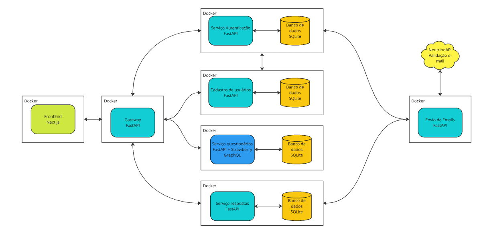

# PsiTest

PsiTest é um aplicativo que permite que psicólogos apliquem testes psicológicos em seus pacientes de forma digital, facilitando a avaliação desses testes e facilitando na definição de um diagnóstico.

A figura abaixo ilustra a arquitetura do projeto.



## Utilização do projeto

Cada componente do projeto está em um repositório separado, e cada um deles possui uma docker file e um docker compose. 

Para utilizar o projeto, é recomendável criar uma pasta para o projeto e clonar cada um dos repositórios dentro dessa pasta.

```bash	
mkdir psitest
cd psitest
git clone https://github.com/vitorcapdeville/psitest-frontend.git
git clone https://github.com/vitorcapdeville/psitest-emails.git
git clone https://github.com/vitorcapdeville/psitest-auth.git
git clone https://github.com/vitorcapdeville/psitest-cadastro.git
git clone https://github.com/vitorcapdeville/psitest-questionarios.git
git clone https://github.com/vitorcapdeville/psitest-respostas.git
git clone https://github.com/vitorcapdeville/psitest-gateway.git
```

Dentro do projeto psitest-auth, é necessário criar um arquivo .env com as seguintes variáveis:

```yaml
SECRET_KEY = INSERIR_SECRET_KEY
ALGORITHM = INSERIR_ALGORITMO
ACCESS_TOKEN_EXPIRE_MINUTES = 600
PSITEST_EMAILS="http://emails:80"
```

A SECRET_KEY e o ALGORITHM são referentes ao encode do JWT, feito via [PyJWT](https://pyjwt.readthedocs.io/en/latest/usage.html#encoding-decoding-tokens-with-hs256).

Dentro do projeto psitest-emails, é necessário criar um arquivo .env com as seguintes variáveis:

```yaml
GOOGLE_APP_PASS=INSERIR_GOOGLE_APP_PASS_AQUI
NEUTRINO_URL="https://neutrinoapi.net"
NEUTRINO_ID=INSERIR_NEUTRINO_ID_AQUI
NEUTRINO_KEY=INSERIR_NEUTRINO_KEY_AQUI
```

O GOOGLE_APP_PASS é a senha de aplicativos do Gmail, que é utilizada para enviar os emails. O NEUTRINO_ID e NEUTRINO_KEY são referentes ao [Neutrino API](https://www.neutrinoapi.com/), que é utilizado para validar os emails.

Dentro do projeto psitest-frontend, é necessário criar um arquivo .env com as seguintes variáveis:

```yaml
AUTH_SECRET=INSERIR_AUTH_SECRET_AQUI
PASSWORD_MIN_LENGTH=1
GATEWAY_URL="http://gateway:80"
AUTH_TRUST_HOST=http://localhost:3000
```

O AUTH_SECRET é referente ao encode do [Auth.js](https://authjs.dev/getting-started/installation?framework=next.js), que ajuda a gerenciar a autenticação do usuário.

Por fim, dentro da pasta raiz onde estão todos os repositórios, é necessário criar um arquivo docker-compose.yaml com o seguinte conteúdo:

```yaml
name: psitest
include:
  - psitest-auth/docker-compose.yaml
  - psitest-cadastro/docker-compose.yaml
  - psitest-questionarios/docker-compose.yaml
  - psitest-respostas/docker-compose.yaml
  - psitest-gateway/docker-compose.yaml
  - psitest-emails/docker-compose.yaml
  - psitest-frontend/docker-compose.yaml
```

Este arquivo faz o merge de todos os docker-compose.yaml em cada projeto e cria os containers para cada serviço.

Antes da primeira execução apenas, é necessário criar uma rede.

```bash
docker network create psitest
```

Por fim, os containers podem ser executados:

```bash
docker compose up
```

O aplicativo pode ser acessado em http://localhost:3000.